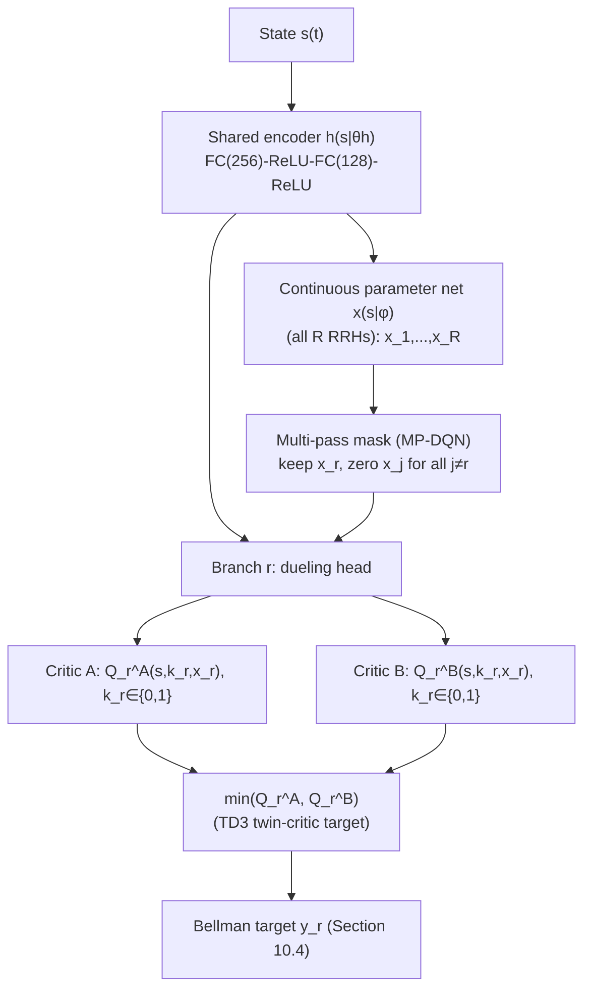
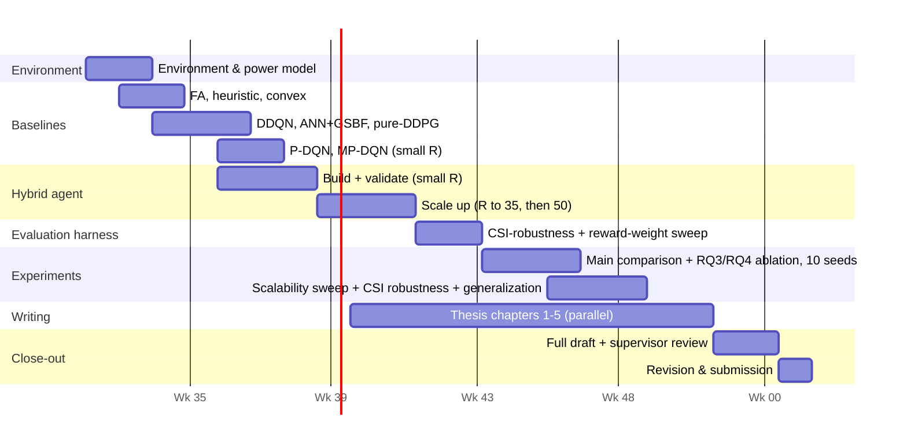

MPHIL THESIS CONCEPT NOTE  —  v4.0

Optimization of Energy-Efficient Cloud Radio Access Networks for 5G Using a Hybrid Discrete-Continuous Deep Reinforcement Learning Framework

Candidate: Gabriel Kwame Freeman   (Index No. PG7373923)

Degree: MPhil  ·  Institution: KNUST

Supervisor: Prof. J. J. Kponyo

Document version: 4.0  (supersedes v3.0)

Prepared: 05 August 2026  ·  Status: Draft for supervisor review — response to the detailed (G1–G14 + relevance) review

Purpose of this note

v3.0 resolved the condensed review of v2.0 (blockers B1–B4, recommendations S1–S6, advisories A1–A6). The supervisor's full, more detailed review of the underlying methodology — organized as an Overall Assessment, a Methodology Assessment (strengths/weaknesses), fourteen Critical Gaps (G1–G14), and a Scientific Relevance and Timeliness discussion — has since been received. Most of the weaknesses in that detailed review target the earlier SAC-DDQN architecture from v1.0 and are already resolved by v2.0/v3.0's move to the branching/MP-DQN/twin-critic design (Section 10); Section 0.1 below maps every item explicitly, including the handful that are genuinely new (most importantly G1–G3's additional named systems, G4, G5, G9, and G10). Section 0 (unchanged from v3.0) still maps the first review round. Everything neither review round flagged (the system model, the MDP formulation, the core network architecture) is carried forward unchanged.

0. Response to Supervisor Review (v2.0 → v3.0)

| ID | Item | Resolution | Section |
|---|---|---|---|
| B1 | Literature review: 4→20-30 refs; P-DQN family through HySoft; O-RAN DRL; 2025 A3C-Dueling DQN C-RAN paper; revised novelty claim | 9 new verified references added (23 total); three new literature subsections | §4.2, §4.4, §4.5, §16 |
| B2 | Specify hybrid critic architecture with diagram; P-DQN vs MP-DQN vs novel, justified | Explicit MP-DQN-multi-pass justification + architecture diagram | §10.3 |
| B3 | Combinatorial action space for N RRHs — how does the discrete head handle 2^N actions? | Dedicated worked-example subsection: there is no 2^N head — branching removes it by construction | §10.3.1 |
| B4 | Revise timeline — 6 weeks is infeasible; reduce scope or extend, with week-by-week Gantt | 20-week week-by-week Gantt; R=50 demoted to stretch goal | §15 |
| S1 | Frame within O-RAN (rApp; O1 for discrete, E2 for continuous) | New section | §11 |
| S2 | Add P-DQN / MP-DQN as baselines | Added as baselines 8–9, with an explicit scaling caveat that itself evidences B3 | §12.1 |
| S3 | CSI robustness: train on perfect CSI, evaluate under N(0,σ²), σ∈{0.01,0.05,0.1} | New evaluation subsection | §12.5 |
| S4 | 10+ seeds; report effect sizes (Cohen's d) alongside p-values | Seed count and statistics updated; `docs/rules.md` seed list updated to match | §12.4 |
| S5 | Define reward-weighting methodology | Manual tuning + documented sensitivity analysis, with a stated criterion for λ1/λ2 | §12.6 |
| S6 | Justify the 5% QoS target against a 3GPP/ITU spec; state traffic class | ITU-R M.2410 + 3GPP TS 22.261 citation; explicitly eMBB, not URLLC | §12.7 |
| A1 | Describe the traffic model | New subsection | §12.8 |
| A2 | State representation at scale (MLP vs GNN/attention) | New subsection | §12.9 |
| A3 | Benchmark inference latency at N=5,10,25,50 | Folded into the scalability sweep sizes; explicit subsection | §12.3 |
| A4 | Reproducibility commitment | New subsection | §12.10 |
| A5 | Generalization experiment (different traffic profile) | New evaluation item | §12.3 |
| A6 | Discuss alternatives considered (P-DQN, HyAR, HySoft, hierarchical) | Expanded design rationale | §10.1 |

0.1  Response to the Detailed Review (second round)

Most items below correspond to weaknesses in the *earlier* SAC-DDQN architecture (v1.0) and are already resolved by the branching/MP-DQN/twin-critic redesign (v2.0/v3.0, Section 10) — marked "resolved by v2.0/v3.0 redesign." The genuinely new items (additional named systems in G1–G3, G4, G5, G9, G10) get new material below.

| ID | Item | Resolution | Section |
|---|---|---|---|
| §2.2 | Shared twin critic architectural ambiguity (how does a critic ingest a one-hot discrete + continuous action?) | Resolved by v2.0/v3.0 redesign — the branching/MP-DQN critic never ingests a one-hot joint action; each branch's critic takes only its own (k_r, x_r) | §10.3 |
| §2.2 | Exploration strategy conflict (SAC entropy vs. DDQN ε-greedy) | Resolved by v2.0/v3.0 redesign — the current design uses only ε-greedy (discrete branches) + decayed Gaussian noise (continuous net, TD3-style); no SAC entropy term remains | §10.5 |
| §2.2 | Combinatorial explosion of discrete actions (2^N) | Resolved by v2.0/v3.0 redesign | §10.3.1 |
| §2.2 | Perfect CSI assumption severity | Resolved by v3.0's CSI-robustness evaluation | §12.5 |
| §2.2 | No inference-time discussion | Resolved by v3.0 | §12.3 |
| §2.2 | Traffic model unspecified (real vs. synthetic) | Resolved by v3.0 | §12.8 |
| G1 | Parameterized-action lineage: add TS-MP-DQN, CP-DQN (Yan et al., 2025) | Added; SAC-D3QN-style dual-head pattern (the reviewer's other example) also added as a representative citation | §4.2 |
| G2 | O-RAN DRL energy work: OREO, ES-xApp, federated TD3, EExApp | Added — **EExApp (INFOCOM 2026) is the closest published related work found and is discussed explicitly, not just listed** | §4.3, §4.4 |
| G3 | 2025 hybrid C-RAN paper (Chuang et al.) | Already resolved in v3.0 | §4.1 |
| G4 | Acknowledge multi-agent/federated RL; justify single-agent scope | Added, citing the federated-TD3 result directly (Liang et al., 2026) | §7.1 |
| G5 | Acknowledge foundation-model/LLM-driven network control as an alternative paradigm | Added | §7.1 |
| G6 | State-space dimensionality at scale | Already resolved in v3.0 | §12.9 |
| G7 | Multi-objective reward-weighting methodology | Already resolved in v3.0 | §12.6 |
| G8 | Reproducibility commitment | Already resolved in v3.0 | §12.10 |
| G9 | No hyperparameter tuning protocol | Added — new subsection | §12.11 |
| G10 | Primary baseline (≥25% vs. All-ON) is a weak floor, not a contribution | Re-ranked: the DDQN/P-DQN/MP-DQN margins (Objective 3) are now stated as the headline comparison; the All-ON figure is explicitly relabeled a sanity-check floor | §5.2 |
| G11 | Modest 5% DDQN margin, statistical power | Already resolved in v3.0 (10 seeds + Cohen's d) | §12.4 |
| G12 | QoS threshold needs 3GPP/ITU context | Already resolved in v3.0 | §12.7 |
| G13 | No generalization evaluation | Already resolved in v3.0 | §12.3 |
| G14 | No inference-time benchmarking | Already resolved in v3.0 | §12.3 |
| §4 (relevance) | O-RAN is the dominant 2023-2026 paradigm | Already resolved in v3.0; strengthened with the new §4.3 systems | §11, §4.3 |
| §4 (relevance) | Perfect CSI increasingly non-default | Already resolved in v3.0 | §12.5 |
| §4 (relevance) | Hybrid-action-space problem has mature solutions; contribution must be precisely defined | Sharpened in the revised synthesis, explicitly against EExApp | §4.4 |
| §4 (relevance) | Foundation models/LLMs as emerging competitors | Added | §7.1 |

1. Purpose of This Document

This concept note summarizes the research problem, the proposed hybrid deep-reinforcement-learning (DRL) methodology, and the evaluation and delivery plan, consolidating the working thesis draft (Chapters 1–3), the prior concept notes (v1.0, v2.0), and this review response into a single current reference. It is a decision and planning document for supervisor review, not a substitute for the full literature review or the thesis chapters themselves, which remain the primary technical record.

2. Background and Problem Statement

Mobile data traffic continues to grow, and the Radio Access Network (RAN) is consistently reported as the dominant contributor to overall network energy consumption — GSMA benchmarking data and independent industry surveys converge on roughly 70–80% of total network power draw, commonly cited around 73%. Cloud Radio Access Network (C-RAN) architectures address part of this by centralizing baseband processing in a shared BBU pool while distributing low-cost Remote Radio Heads (RRHs), but the continuous operation of densely deployed RRHs and their fronthaul links still represents a large, largely static energy cost.

Existing mitigation strategies fall into two camps. Traditional optimization — convex relaxations, greedy heuristics, bin-packing — is computationally cheap but requires near-perfect channel state information and adapts poorly to non-stationary traffic. Deep reinforcement learning adapts to stochastic, time-varying conditions, but the published work closest to this thesis (Section 4) has generally handled RRH activation (a discrete on/off decision) and transmit power allocation (a continuous decision) as two separate, decoupled problems — for example, a discrete DQN/DDQN policy for RRH state feeding a convex solver for power. The gap this thesis targets: no existing C-RAN approach jointly learns discrete RRH activation and continuous power allocation within a single end-to-end DRL policy, and fronthaul power is frequently left out of the reward formulation despite representing a meaningful share of total consumption.

3. Methodological Note: Grounding the Hybrid Architecture

The project's methodology has evolved twice: from a single continuous-action DDPG agent (the original registration and the v1 concept note) toward a hybrid discrete-continuous framework (v2.0), assembled from four established, peer-reviewed components rather than a bespoke design:

Parameterized action coupling — P-DQN (Xiong, Wang, Yang et al., 2018) couples a discrete decision with an associated continuous parameter through one Q-network: a DQN-style update for the discrete choice, and a DDPG-style deterministic policy gradient for the continuous parameter.

Correcting P-DQN's false gradients — MP-DQN (Bester, James & Konidaris, 2019) evaluates each discrete branch's Q-value using only its own continuous parameters (a "multi-pass" over the network), removing the cross-talk P-DQN otherwise introduces between unrelated RRHs.

Scaling to many independent decisions — the branching architecture (Tavakoli, Pardo & Kormushev, 2018) gives each RRH its own decision branch off a shared state representation, so the action output grows linearly (2R) rather than combinatorially (2^R) with the number of RRHs.

Training stability — twin critics, delayed updates and target-policy smoothing (Fujimoto et al., 2018) address the overestimation-bias instability that motivated moving past plain DDPG in the first place.

This version (v3.0) keeps that architecture unchanged — the review's B2/B3 items asked for the architecture to be specified more concretely and defended more explicitly, not redesigned — and expands the literature review (B1), adds an O-RAN framing (S1), and strengthens the evaluation plan (S2–S6, A1–A6).

4. Review of Closely Related Work and the Research Gap

4.1  C-RAN energy-efficiency literature

| Work | Technique | How activation & power are handled | Relation to the proposed hybrid |
|---|---|---|---|
| Iqbal, Tham & Chang (2021) — DQN/DDQN | Double Deep Q-Network + convex SOCP solver | DDQN picks one RRH's on/off status per slot; power/beamforming for the resulting set is solved as a separate SOCP every slot | Source of the system model and the discrete-RL baseline; the proposed hybrid keeps true discrete RRH decisions but couples them to power via one learned network instead of a per-slot solver |
| Fathy, Abood & Hamdi (2021) — ANN + Bi-Section GSBF | Supervised ANN + 3-stage GSBF heuristic | ANN predicts the near-optimal RRH count from offline-labelled data; GSBF heuristic then selects and beamforms | Supervised-learning baseline; needs labelled data from a slow heuristic and has no MDP or switching-cost notion |
| Xu, Wang, Tang, Wang & Gursoy (2017) | DNN value approximation + convex optimization | Same two-stage pattern as Iqbal et al. (its precursor) | Same structural limitation; earlier, simpler value network |
| Zhou et al. (2023) — Co-HDRL, RIS-aided RAN | Cooperative hierarchical DRL, two coordinated sub-controllers | One controller for discrete sleep, one for continuous RIS/power control, coordinated hierarchically | Closest in spirit — also couples discrete and continuous decisions — but via two separately-optimized hierarchical policies rather than one P-DQN-style coupled network, and for a different (RIS-aided) architecture |
| Al-Zubaedi (2019) — PhD thesis | Metaheuristics: Quasi-Newton Method, PSO, NMBS | Optimizes BBU-pool placement and RRH-to-BBU clustering (network planning) | Different timescale — deployment/planning, not the slot-by-slot EE resource-allocation problem this thesis targets |
| Chuang, Li, Zhu, Wei, Qiu & Xin (2025) — hybrid A3C + Dueling DQN | Actor-critic (A3C) for global scheduling + Dueling DQN for discrete resource decisions, in a 5G C-RAN | Applied to industrial power-plant monitoring data scheduling and energy management over a 5G C-RAN link, not to RRH on/off or downlink transmit-power control | Confirms the A3C/Dueling-DQN combination is an active 2025 research direction in "5G C-RAN + DRL," but for a different decision problem (industrial IoT resource scheduling) and a different action structure (no continuous power parameter, no per-RRH branching); does not overlap with, and so does not weaken, the gap below |
| Proposed hybrid (this thesis) | Branching, multi-pass, twin-critic parameterized DQN | Each RRH gets its own discrete activation branch and continuous power/bandwidth parameters, coupled through one Q-network family | Extends the discrete formulation of Iqbal et al. with genuinely continuous power control, without a per-slot solver and without continuous-relaxing the discrete decision |

4.2  Discrete-continuous reinforcement learning building blocks

These are not C-RAN papers; they are the general-purpose DRL components Section 10 combines for this problem, extended per B1 to cover the full lineage the reviewer asked for.

| Component | Source | Role in the proposed framework |
|---|---|---|
| Continuous relaxation (PA-DDPG) | Hausknecht & Stone (2016) | The approach used in the v1 concept note (RRH activation as a continuous variable, thresholded); kept as the "pure-DDPG" baseline in Section 12 to isolate the effect of true discrete actions |
| P-DQN | Xiong, Wang, Yang et al. (2018) | Core mechanism coupling each discrete RRH decision to its continuous power/bandwidth parameters through one Q-network |
| MP-DQN | Bester, James & Konidaris (2019) | Multi-pass fix for P-DQN's parameter cross-talk between unrelated RRHs |
| HyAR (hybrid action representation) | Li, Tang, Zheng, Hao, Li, Wang, Meng & Wang (2022), ICLR | Learns a compact, decodable latent embedding of the joint discrete-continuous action via a conditional VAE, rather than evaluating the raw action directly; considered and not adopted (§10.1) |
| HySoft | Anonymous/unconfirmed author list (2025), *ScienceDirect* — flagged for verification, see note below | A 2025 maximum-entropy (soft) extension of P-DQN/MP-DQN with Q-value rescaling for exploration-exploitation balance; reported to outperform P-DQN/MP-DQN on standard hybrid-action benchmarks (Platform, Moving, Robot Soccer Goal, Catch Point); considered and not adopted (§10.1) |
| Branching / BDQ | Tavakoli, Pardo & Kormushev (2018) | Per-RRH decision branches off a shared encoder, avoiding 2^R combinatorial action growth |
| TD3 (twin critics) | Fujimoto, van Hoof & Meger (2018) | Twin critics, delayed updates, target-policy smoothing — the concrete fix for the DDPG instability that motivated this revision |
| TS-MP-DQN | **Verified.** Zhang, X., Jin, S., Wang, C., Zhu, X., & Tomizuka, M. (2022). *Learning Insertion Primitives with Discrete-Continuous Hybrid Action Space for Robotic Assembly Tasks*. IEEE ICRA 2022. arXiv:2110.12618. (UC Berkeley, Dept. of Mechanical Engineering.) TS-MP-DQN is proposed directly in this paper — not, as first thought, merely cited by it — adding twin Q-networks (clipped double Q-learning) and target-policy smoothing to MP-DQN to reduce Q-value overestimation, for a robotic peg-insertion task, not a wireless/RAN one. | Same TD3-style overestimation fix as adopted independently here via Fujimoto et al. (2018) directly on the twin critics — confirms this fix is recognized as necessary in the parameterized-action-space literature specifically (robotics), not just the general actor-critic literature; no RAN/C-RAN application of TS-MP-DQN was found |
| CP-DQN | **Verified.** Yan, C., Chen, S., Xu, J., Wang, X., & Peng, Z. (2025). Hybrid Reinforcement Learning in parameterized action space via fluctuates constraint. *Engineering Applications of Artificial Intelligence* (published Oct. 2025; volume/issue/pages not yet confirmed — journal identity is now confirmed, only the exact volume/pages remain outstanding). | Adds a parameter-fluctuation-restriction (PFR) constraint so a branch's continuous parameter doesn't oscillate between adjacent timesteps when the discrete choice is unstable; a candidate refinement for the switching-cost-heavy reward in Section 10.2, noted as future work rather than adopted now |
| Dual-head D3QN+SAC (representative example) | Wang (2025), arXiv:2510.17877 — IRS-assisted UAV spectrum sharing, one of several 2024–2025 papers using a D3QN-discrete/SAC-continuous dual-head pattern (the reviewer's "SAC-D3QN" family) | The general pattern this thesis's architecture (Section 10) also descends from, applied to a different problem (IRS/UAV, not C-RAN RRH activation) and via two separate heads rather than one MP-DQN-coupled network — the precise distinction argued in §4.4 |

> **Verification note (Ethical AI Rule, `docs/rules.md` §10):** the HySoft entry above was located via a literature search of ScienceDirect (article identifier S2405896325027430, 2025) and independently confirms P-DQN/MP-DQN as its baselines, which is why it belongs in this table. Its exact author list, journal name and volume were not resolved from the search snippet and must be confirmed against the source PDF before this note or the thesis bibliography is finalized — the same treatment v1.0 gave to two unverified references (see `manuscript/concept_document.md` §12).

4.3  O-RAN-specific DRL energy optimization (new, B1-ii)

| Work | Approach | Relevance |
|---|---|---|
| Bordin, Lacava, Polese, Satish, AnanthaSwamy Nittoor, Sivaraj, Cuomo & Melodia (2025), *IEEE CCNC* | PPO and DQN agents dynamically activate/deactivate base-station RF frontends, deployed against `ns-O-RAN` (a 3GPP-compliant, full-stack O-RAN simulator) with users, mobility and handovers | O-RAN-native analogue of the discrete half of this thesis's action space; uses only single-algorithm discrete control (PPO *or* DQN), not a coupled discrete-continuous policy |
| Bordin, Lacava, Polese, Cuomo & Melodia (2025), *IEEE CCNC* (demo companion), DOI 10.1109/CCNC54725.2025.10975928 | Demo/tooling companion to the above: `ns-O-RAN` + Gymnasium harness for training and evaluating O-RAN DRL agents | Candidate simulation-harness reference if the thesis's O-RAN framing (§11) is extended to an actual O-RAN-interface simulator in future work |
| Sohaib, Shah, Onireti, Sambo & Imran (2024), arXiv:2407.11563 | Distributed on-/off-policy transfer-learning DRL for cloud-native O-RAN resource allocation serving eMBB and URLLC together | Directly relevant to the eMBB/URLLC QoS-class distinction raised in S6 (§12.7); a candidate reference for extending this thesis to mixed traffic classes as future work |
| Sthankiya, Saeed, McSorley, Jaber & Clegg (2024), arXiv:2411.02164, *IEEE Access* | Survey of AI-driven energy optimization in next-generation RAN; explicitly quantifies the energy cost of the AI techniques themselves alongside the savings they produce | Motivates including inference-latency/compute-cost reporting (A3, §12.3) as a first-order concern, not an afterthought |
| "OREO" — Open RAN Energy Optimisation via Deep Reinforcement Learning for 6G Networks. Qazzaz, M. M. H., Salama, A., Hafeez, M., & Zaidi, S. A. R. (University of Leeds). **Authors confirmed consistently across independent sources (the same group's related O-RAN work, e.g. arXiv:2509.09343, corroborates the author list); venue/year is reported as *IEEE Open Journal of the Communications Society* (2026), but this could not be confirmed against a primary source (arXiv/IEEE Xplore page) and a specific DOI/arXiv ID could not be located — flagged for a direct-source check before citing the venue/year in the thesis bibliography.** | PPO rApp in the Non-RT RIC, hierarchical rApp-xApp architecture, jointly optimizes RU activation state *and* user-association policy; evaluated with Sionna ray-tracing channel models; reports 34.6% energy reduction at 0.89% outage | The first system in this table to jointly optimize *two* decisions (RU activation + association) rather than one — still both effectively discrete/categorical policy outputs from a single PPO policy, not a discrete-plus-continuous-parameter coupling; discussed further in §4.4 |
| Wang, Chetty, Al-Tahmeesschi, Liang, Chu & Ahmadi (2024), *IEEE CAMAD*, arXiv:2409.15098 ("ES-xApp") | Two DQN-based xApps (RSS+geolocation; RSS-only) for radio-card sleep decisions in 6G O-RAN; 50% of radio cards switched off at 50 UEs vs. 17% for a heuristic | Single-decision-type (discrete only, no continuous power/bandwidth parameter); a candidate discrete-only O-RAN baseline for future extension of this thesis's baseline suite (§12.1) |
| Liang, Al-Tahmeesschi, Chetty, Cavdar, Canberk & Ahmadi (2026), arXiv:2604.00201 | Federated TD3 (continuous control of RU sleep depth) with an rApp aggregator in the Non-RT RIC and xApp local agents; >50% energy saving, 43.75% faster convergence, 37.4% lower training energy vs. centralized baselines | Directly relevant to G4 (§7.1): demonstrates the federated/multi-agent alternative this thesis's single-agent scope (Section 8) deliberately trades away for tractability; cited there as the justification reference |
| Lu, Yan & Zeng (2026), *IEEE INFOCOM*, arXiv:2602.09206 ("EExApp") | Dual-actor-dual-critic PPO with a bipartite Graph Attention Network (GAT) coordinating the two critics (energy vs. QoS); jointly optimizes RU sleep scheduling (discrete) *and* DU resource slicing (continuous); deployed and evaluated on a **real O-RAN testbed** with live traffic and commercial hardware | **Closest published related work found in this review.** Genuinely couples a discrete activation-style decision with a continuous resource-allocation decision for RAN energy efficiency. Discussed explicitly, not just tabulated, in §4.4 |

4.4  Synthesis: the research gap (revised per B1, and again per the detailed review's G1–G3)

The C-RAN literature converges on the same structural limitation from three algorithmic directions — DDQN-plus-SOCP, ANN-plus-heuristic, DNN-plus-convex — and even the closest hybrid attempt (Zhou et al., 2023) uses two separately-optimized policies rather than one coupled network. The 2025 A3C-plus-Dueling-DQN C-RAN paper (Chuang et al., 2025) confirms that combining an actor-critic method with a discrete-action method is an active idea in the "5G C-RAN + DRL" space generally, but applies it to an unrelated decision problem (industrial data-scheduling, not RRH activation/power), so it neither anticipates nor weakens this thesis's specific contribution.

**EExApp (Lu, Yan & Zeng, 2026) requires a direct, honest reckoning rather than a passing mention.** It is, on the evidence gathered for this revision, the closest published work to this thesis's actual claim: it jointly optimizes a discrete decision (RU sleep scheduling) and a continuous decision (DU resource slicing) for RAN energy efficiency, and — unlike this thesis — it is validated on a real O-RAN testbed rather than in simulation. The distinction this thesis's contribution still rests on is architectural, not just domain-relabeling: EExApp couples its two decisions via **two separate actor-critic pairs** (a dual-actor-dual-critic PPO, energy-critic and QoS-critic, arbitrated by a graph-attention gate), which is structurally the *hierarchical, separately-optimized-policies* pattern this thesis's gap statement already argues against (the same pattern as Zhou et al.'s Co-HDRL, §4.1). This thesis instead couples its discrete and continuous decisions through **one** parameterized Q-network family per RRH (the P-DQN/MP-DQN mechanism, Section 10.3), with no second actor-critic pair and no attention-based arbitration step. Whether one coupled network or two coordinated ones is the better design for this problem is now an open, empirically-answerable question rather than a claim to assert — and it sets a much higher bar for what "the hybrid outperforms the alternatives" (RQ3/RQ4, Section 6) needs to show. EExApp's real-testbed validation is also a legitimate strength this thesis does not have; Section 8's simulation-only scope is acknowledged as a limitation partly *because* of this comparison, not only because of resource constraints.

OREO (2025) and ES-xApp (Wang et al., 2024) are less direct competitors: OREO's PPO policy jointly picks RU activation state and UE association, but both remain policy outputs from one PPO network rather than a discrete-plus-continuous-parameter coupling, and ES-xApp is discrete-only (radio-card sleep, no continuous power/bandwidth decision). Sohaib et al. (2024) and the federated-TD3 work (Liang et al., 2026) address a different axis (traffic-class transfer learning; federated/multi-agent scaling) rather than the discrete-continuous coupling question itself.

Separately, the general parameterized-action-space DRL literature has well-tested tools for exactly this discrete-plus-continuous-parameter structure (P-DQN, MP-DQN, branching, and — very recently — HyAR, HySoft, TS-MP-DQN and CP-DQN), but none of them, to my knowledge, has been applied to the C-RAN or O-RAN joint RRH/RU-activation-and-power problem specifically, nor benchmarked against the DDQN and ANN+GSBF baselines already established for C-RAN, nor framed against O-RAN's rApp/E2/O1 interface split. **That is the gap this thesis targets**, restated precisely in light of EExApp: a branching, multi-pass, twin-critic *single coupled network* for joint RRH activation and power control, evaluated head-to-head against the exact baselines from Iqbal et al. (2021) and Fathy et al. (2021), against P-DQN/MP-DQN directly (S2), against the simpler continuous-relaxation (pure-DDPG) alternative from the v1 concept note, and positioned as a deployable O-RAN rApp (S1) — with EExApp's dual-actor-dual-critic design named in Chapter 2 as the nearest comparable architecture and the one this thesis's coupled-network claim must be defended against, not merely listed alongside.

5. Aim and Objectives

5.1  Aim

To design, implement and evaluate a hybrid discrete-continuous DRL framework — combining branching Q-learning for RRH activation with parameterized continuous control for power and bandwidth — that maximizes long-term energy efficiency in a 5G C-RAN subject to QoS constraints, and that scales tractably from small to large RRH counts.

5.2  Specific objectives

Formulate the joint RRH-activation-and-power-control problem as a parameterized-action MDP (Section 10.2) compatible with branching P-DQN/MP-DQN.

Design and train the hybrid agent — branching discrete heads, a continuous parameter network, and twin critics — addressing the false-gradient and combinatorial-scaling issues documented in the P-DQN/branching literature from the outset rather than retrofitting fixes (Section 10.3, 10.3.1).

Re-implement Full Activation, a greedy/NMBS heuristic (Al-Zubaedi, 2019), convex-only power allocation, DDQN (Iqbal et al., 2021), ANN+GSBF (Fathy et al., 2021), pure-DDPG (continuous relaxation) and, newly, P-DQN and MP-DQN (Section 12.1) as baselines under identical simulation conditions to the proposed agent.

Evaluate energy efficiency, QoS-violation rate, RRH-switching frequency, training stability and convergence, computational cost, CSI robustness (Section 12.5) and cross-traffic-profile generalization (Section 12.3), benchmarking improvements against the margins reported by the closest published baselines rather than a fixed pass/fail target. **Objective ranking (revised per G10):** the headline comparison is the margin over DDQN (Iqbal et al., 2021) and over P-DQN/MP-DQN directly (RQ4, Section 6) — both non-trivial DRL baselines already solving a version of this problem. The all-RRHs-on/uniform-power figure is retained only as a sanity-check floor that any working method, including the simple heuristics, is expected to clear comfortably; it is not reported as a contribution in its own right.

Characterize how training time and performance scale from small (5 RRH) to large (≈50 RRH) network instances, exploiting the branching architecture's linear action-space growth, and report inference latency at each scale (Section 12.3).

Position the resulting policy as a deployable O-RAN rApp, mapping its discrete and continuous decisions onto O-RAN's O1 and E2 interfaces respectively (Section 11).

6. Research Questions

How should the joint RRH-activation-and-power-control problem be formulated as a parameterized-action MDP so a branching P-DQN/MP-DQN agent can learn both decisions through one coupled network?

What architecture, reward design and training configuration (multi-pass evaluation, branching, twin critics) achieve stable convergence for this MDP as RRH count grows?

Does representing RRH activation as a true discrete decision (the hybrid framework) outperform the continuous-relaxation approach (pure DDPG), and by how much — holding the rest of the pipeline fixed?

How does the resulting policy's energy efficiency and QoS performance compare with DQN-, DDQN-, ANN+heuristic- and parameterized-DQN (P-DQN/MP-DQN)-based approaches under identical network conditions?

What is the trade-off between energy savings, QoS satisfaction and RRH-switching frequency, and how does it hold up as the network scales from 5 to ≈50 RRHs?

How robust is the trained policy to channel-state-information (CSI) estimation error it was never trained against, and to a traffic profile it was never trained on?

7. Significance of the Study

Extends the discrete-action DRL and supervised-learning literature for C-RAN energy efficiency (Iqbal et al., 2021; Fathy et al., 2021) with a hybrid framework that avoids both the per-slot solver of the former and the offline-labelling requirement of the latter.

Brings peer-reviewed discrete-continuous RL methods (P-DQN, MP-DQN, branching, TD3) into the C-RAN domain for the first time, to my knowledge, rather than a bespoke architecture, and is the first, to my knowledge, to frame such a policy as an O-RAN-deployable rApp with an explicit O1/E2 interface split (Section 11).

Produces a reusable simulation and benchmarking harness (FA, heuristic, convex, DDQN, ANN+GSBF, pure-DDPG, P-DQN, MP-DQN, hybrid) for future C-RAN DRL work.

The scalability characterization (5–50 RRH), the CSI-robustness and generalization results, and the energy/QoS/switching trade-off findings are relevant to green-communication planning for 5G and future 6G networks, including resource-constrained deployment settings.

7.1  Adjacent paradigms acknowledged but out of scope (G4, G5)

Two active research directions are related to this thesis but deliberately not adopted, and are named here so the single-agent, non-foundation-model scope in Section 8 reads as a considered choice rather than an omission:

- **Multi-agent and federated RL (G4).** Liang et al. (2026) — the federated-TD3 O-RAN energy work in §4.3 — show that a federated/multi-agent formulation (an rApp aggregator with per-site xApp agents) achieves faster convergence, lower training energy, and comparable-or-better energy savings than a centralized baseline, at the cost of a materially more complex distributed-training pipeline. This thesis's single-centralized-agent, single-BBU-pool scope (Section 8) trades that distributed-robustness and convergence-speed benefit for a simpler, more tractable problem that fits an MPhil timeline (Section 15); extending the branching-MP-DQN-TD3 architecture to a federated multi-pool setting, following Liang et al.'s pattern, is noted as future work.
- **Foundation models and LLM-driven network control (G5).** Attention-based and LLM-driven hierarchical RL for network optimization is an emerging (2024–2026) alternative paradigm to the value-based/actor-critic methods this thesis builds on. It is acknowledged here as a direction the field is exploring, but no specific foundation-model baseline is adopted: at the time of this revision, no foundation-model approach was located that targets the specific joint RRH-activation-and-power problem this thesis addresses, so there is no like-for-like baseline to add, unlike P-DQN/MP-DQN (S2) where a direct comparison was possible.

8. Scope and Assumptions

Downlink transmission only; a single BBU pool; a single centralized DRL agent; uplink, multi-pool scenarios and multi-agent RL are out of scope.

Evaluation is simulation-based (MATLAB, consistent with the existing simulation work); no physical or SDR testbed is used.

Channel state information is assumed available to the BBU pool at training time. The CSI-robustness evaluation added in Section 12.5 (S3) is a post-hoc *evaluation* of a policy trained under this assumption — it stress-tests, but does not remove, the perfect-CSI assumption, so it does not expand the thesis scope under the Scope Boundary Rule (`docs/rules.md` §6); training under imperfect CSI remains future work.

The 5→50 RRH scalability sweep is the reason the branching architecture (Section 10) was chosen over a joint discrete action space, which would grow combinatorially and become intractable well before 50 RRHs (quantified in Section 10.3.1). Per the revised timeline (Section 15), R=50 is a stretch goal rather than a committed deliverable.

The QoS target (5% violation rate) applies to an eMBB-class traffic model, per the traffic-class justification in Section 12.7; URLLC- and mMTC-specific QoS modeling remain out of scope.

Any expansion of this scope will be brought back to the supervisor as a further revision of this document.

9. System Model (Summary)

Chapter 3 of the thesis already derives the system model in detail — the RRH/UE/BBU network model, path-loss and SINR expressions, Shannon capacity, and the three-part power model (RRH, fronthaul, BBU pool) — following Iqbal et al. (2021) for the radio model and Al-Zubaedi (2019) for the BBU-pool and fronthaul power model. This does not change with this revision and is not repeated here; it is summarized only to fix notation for Section 10.

The network comprises RRHs R = {1,…,R}, UEs U = {1,…,U} and BBUs B = {1,…,B}, connected by a fronthaul link. Each RRH r serves users through joint beamforming; UE u's achievable rate C_u(t) follows the Shannon capacity of its SINR. Total network power at slot t sums RRH power (active/sleep/switching), fronthaul power (OLT + ONU) and BBU-pool power (static + load-dependent). Energy efficiency is

EE(t) = Σu∈U Cu(t)  ⁄  [ B × Ptotal(t) ]

and the long-run objective is to choose, at every slot, which RRHs are active and at what power, to maximize Σᴛ EE(t) subject to each user's rate demand and each RRH's power ceiling — the same objective as Chapter 3, equation (9), and Iqbal et al. (2021), equation (9). What changes with this revision is only how the controller that makes those choices is built, evaluated, and framed.

10. Proposed Hybrid DRL Framework

10.1  Design rationale (expanded per A6)

The shared encoder and branching heads (Tavakoli et al., 2018) let R independent RRH on/off decisions scale linearly rather than combinatorially; the P-DQN coupling (Xiong et al., 2018), corrected by MP-DQN's multi-pass evaluation (Bester et al., 2019), lets each branch's decision carry its own continuous power and bandwidth parameters without cross-talk from other RRHs; and TD3-style twin critics (Fujimoto et al., 2018) address the overestimation bias that made plain DDPG the less stable choice.

Three alternatives were considered and not adopted, per A6:

- **HyAR** (Li et al., 2022) learns a latent VAE embedding of the joint action instead of evaluating it directly. It reports strong results on high-dimensional benchmarks, but the extra representation-learning stage (embedding table + conditional VAE, trained jointly with the policy) adds a failure mode — a poorly-conditioned latent space — on top of the branching/multi-pass instability already flagged as the top risk in Section 14, and makes the switching-cost term in the reward (§10.2) harder to interpret, since it no longer acts directly on an observable binary k_r. Given the timeline pressure that produced B4, this additional risk was judged not worth taking for an MPhil.
- **HySoft** (2025) is, on the search evidence in Section 4.2, a genuine improvement on P-DQN/MP-DQN, but it is too recent (2025) to have an established, independently-verified open-source reference implementation, and its authorship is itself still pending verification (§4.2). Adopting an unverified, unreproduced 2025 method as the *primary* architecture would conflict with the Reproducibility Rule (`docs/rules.md` §4). It remains a natural comparison point for a follow-up paper once verified.
- **A fully hierarchical decomposition** (in the style of Zhou et al.'s Co-HDRL, 2023) — one policy for discrete activation, a separate policy for continuous power, coordinated top-down — was rejected because it is exactly the two-separately-optimized-policies pattern this thesis's gap statement (§4.4) argues against; adopting it would concede the novelty claim rather than defend it.

No part of the adopted design needs to be taken on faith — each piece has its own published ablation showing it does what it is used for here.

10.2  MDP formulation

State space

s(t) = [ D1(t),…,DU(t),  k1(t−1),…,kR(t−1),  g1,1(t),…,gR,U(t),  ρBBU(t),  E(t) ]T

k_r(t−1) is RRH r's true binary activation state (0/1) from the previous slot.

Action space — a parameterized (hybrid) action

Each RRH r contributes one discrete choice and, when active, a pair of continuous parameters:

a(t) = { ( kr(t),  xr(t) )  :  r = 1,…,R },   xr(t) = ( pr(t), βr(t) )

k_r(t)∈{0,1} is RRH r's true discrete activation decision. p_r(t)∈[0,P_r^max] is transmit power and β_r(t)∈[0,1] is bandwidth share (Σ_r β_r ≤ 1); both are only physically meaningful when k_r(t)=1, and are defined as 0 otherwise. This is exactly the parameterized action space 𝓜 = {(k,x_k)} of Xiong et al. (2018), applied independently across R RRHs via branching.

Reward function

r(t) = EE(t)  −  λ1 Σu∈U max(0, Du(t) − Cu(t))  −  λ2 Σr∈R |kr(t) − kr(t−1)|

|k_r(t)−k_r(t−1)| ∈ {0,1} is an exact switching-event count. λ1, λ2 are set per the methodology in Section 12.6 (S5). λ1=λ2=0 recovers a reward equivalent to Iqbal et al.'s EE(t), the standing sanity check.

10.3  Network architecture and the hybrid critic (B2)

The critic follows the **MP-DQN multi-pass approach**, not the P-DQN concatenation approach, and this is a specific, justified choice rather than a default: P-DQN's original design feeds *all* R RRHs' continuous parameters into *every* branch's Q-value computation, which Bester et al. (2019) show injects false gradients — branch r's discrete decision appears to depend on branch j's continuous parameters, even though physically it should not (RRH r's on/off value depends on RRH r's own power/bandwidth, not RRH j's). MP-DQN's multi-pass evaluation — masking every other branch's continuous parameters to zero before computing branch r's Q-value — removes this cross-talk. Given that this thesis's whole motivation for branching is to decompose R *independent* per-RRH decisions (Section 10.3.1), inheriting P-DQN's cross-talk would silently undermine that independence; MP-DQN is therefore not an incidental choice but a structural requirement of the design.

Concretely, per RRH branch r:

- Shared encoder h(s|θ_h): state s(t) → shared representation; two fully-connected layers (256, 128 units, ReLU).
- Continuous parameter network x(s|φ): a DDPG-style deterministic sub-network producing x_r(s) = (p_r, β_r) for all R RRHs from the shared representation (P-DQN mechanism, Xiong et al., 2018).
- Multi-pass mask (Bester et al., 2019): before branch r's Q-value is computed, x_r is passed in and every other RRH's continuous parameters are masked to zero.
- R discrete branches (Tavakoli et al., 2018): each RRH gets a dueling-style head producing Q_r(s,k_r) for k_r∈{0,1} off the shared representation plus its own (masked) x_r, so the output grows as 2R rather than 2^R.
- Twin critics (Fujimoto et al., 2018): two independent copies of the branch/critic network (Q^A, Q^B), each with its own target network; the Bellman target uses min(Q^A, Q^B) to counter overestimation bias, with delayed, less-frequent updates to φ and target-policy smoothing noise on x' at the target networks.

Architecture diagram (one representative branch r; replicated independently for r=1,…,R):

10.3.1  Answering B3: how the discrete side handles N RRHs without a 2^N head

There is no single DDQN head evaluating a joint 2^R-way discrete action, and this is by construction, not an omission. A naive joint formulation would require one Q-network output per element of {0,1}^R — for R=50, that is 2^50 ≈ 1.13 × 10^15 outputs, which is intractable to represent, let alone explore, for any R beyond about 15–20. The branching architecture in Section 10.3 sidesteps this entirely: it never instantiates a joint discrete action space. Instead, R *independent* dueling heads each output two Q-values (Q_r(s,0), Q_r(s,1)), so the total discrete output size is exactly 2R — for R=50, that is 100 scalar Q-values, plus 100 continuous parameters (p_r, β_r for each r), i.e. ≈200 scalar outputs in total, a linear rather than exponential footprint. Each branch selects its own k_r independently by ε-greedy over its own two Q-values (Section 10.4, per-branch loop); the joint action a(t) is simply the concatenation of all R independent per-branch choices. This is the direct payoff of the branching/BDQ formulation (Tavakoli et al., 2018) chosen in Section 10.1, and it is also why P-DQN and MP-DQN *without* branching are only usable as baselines at small R (Section 12.1, S2) — they would otherwise face exactly the 2^R blow-up this section describes.

10.4  Training algorithm

Combining P-DQN's coupling mechanism, MP-DQN's multi-pass correction, branching's per-RRH decomposition and TD3's twin-critic stabilization:

1.  Initialize shared encoder h(s|theta_h), twin branch

networks Q^A, Q^B (R dueling branches each, params

theta_QA, theta_QB), and continuous parameter network

x(s|phi).

2.  Initialize targets: theta_h', theta_QA', theta_QB',

phi'  <-  theta_h, theta_QA, theta_QB, phi.

3.  Initialize an empty replay buffer (capacity N_D).

4.  for episode = 1 to M do

Observe initial state s_t from the environment (t=1).

for t = 1 to T do

Compute x_t = x(s_t|phi) + noise_t  (Gaussian, TD3-

style).

for r = 1 to R do  (multi-pass: mask other RRHs)

Compute Q_r^A(s_t,k_r,x_t | mask=r), k_r in {0,1}.

Select k_r,t by epsilon-greedy over Q_r^A(s_t,.,x_t).

end for

Apply a_t = {(k_r,t, x_r,t)} for all r; observe

reward r_t and next state s_t+1.

Store (s_t, {k_r,t}, x_t, r_t, s_t+1) in the buffer.

Sample a random mini-batch of N transitions.

For each i: k_r,i' = argmax_k Q_r^A(s_i+1,k,x'|phi')

per branch (multi-pass); x' smoothed with noise.

Set y_i = r_i + gamma * min(Q^A',Q^B')(s_i+1,

{k_r,i'}, x').

Update Q^A, Q^B by minimizing

L = (1/N) sum_i sum_r (y_i - Q_r(s_i,k_r,i,x_i))^2.

every d steps:

Update phi via the multi-pass policy gradient:

grad_phi J ~= (1/N) sum_i sum_r

  grad_x Q_r^A(s_i,k_r,i,x)|x=x(s_i|phi)

  . grad_phi x_r(s_i|phi).

Soft-update targets: theta' <- tau*theta +

(1-tau)*theta'  (for h, Q^A, Q^B, phi).

end for

5.  end for

10.5  Design notes

No threshold/hysteresis workaround: because k_r(t) is a genuine discrete output, thresholding and hysteresis-band logic are not needed.

Multi-pass is not optional: using P-DQN's original single-pass evaluation is documented to invalidate the theoretical grounding of the discrete update (Bester et al., 2019); the multi-pass masking in Section 10.3 is part of the base design.

Compute cost grows with R: R branches × 2 critics × multi-pass means R forward passes per critic evaluation per step. At R≈50 this is the most likely practical bottleneck, addressed by the timeline in Section 15 (profiling scheduled early, R=50 as a stretch goal).

Exploration uses two mechanisms: epsilon-greedy (decayed) for the R discrete branches, and additive Gaussian noise (decayed) for the continuous parameters.

11. O-RAN Positioning (new, S1)

Even though the evaluation environment (MATLAB, Section 8) does not implement O-RAN's actual interfaces, the trained SAC-DDQN-lineage policy maps naturally onto O-RAN's split-control architecture, and stating this costs nothing in implementation while materially increasing the work's relevance:

- The **discrete decision** k_r(t) (RRH on/off) is a configuration-management-style action with a naturally slower cadence — exactly the kind of decision O-RAN routes through the **O1 interface** from the Non-RT RIC (minutes-to-hours control loop), consistent with how Bordin et al. (2025, §4.3) frame RF-frontend activation/deactivation in their O-RAN DRL work.
- The **continuous decision** x_r(t) = (p_r(t), β_r(t)) (transmit power, bandwidth share) is a faster, per-slot control action — the kind of decision O-RAN routes through the **E2 interface** between the Near-RT RIC and E2 nodes (10 ms–1 s control loop).
- The policy itself would be deployed as an **rApp** in the Non-RT RIC, issuing the O1 (discrete) decisions directly and the E2 (continuous) decisions as policy guidance consumed by a co-located xApp — the same rApp/xApp split used by Bordin et al. (2025).

This framing surfaces one honest limitation rather than hiding it: the current MDP (Section 10.2) makes both decisions at the *same* cadence (once per slot t), whereas a real O-RAN deployment would likely split them across the two different-timescale loops above. Reconciling the single-slot joint MDP with a two-timescale O1/E2 split is noted as future work (Section 16) and does not change the present evaluation, which remains simulation-based per Section 8.

12. Evaluation Plan

12.1  Baselines (S2)

Nine methods are compared under identical simulation conditions: Full Activation (FA), a greedy/NMBS bin-packing heuristic (Al-Zubaedi, 2019), convex-only power allocation with fixed RRH selection, DDQN (Iqbal et al., 2021), ANN + Bi-Section GSBF (Fathy et al., 2021), pure DDPG with continuous relaxation (the v1 concept note's design, kept specifically to answer RQ3), **P-DQN** (Xiong et al., 2018) and **MP-DQN** (Bester et al., 2019) without branching or twin critics, and the proposed hybrid agent.

P-DQN and MP-DQN are run only at the smaller scalability-sweep sizes (R=5 and R=12, i.e. 2^5=32 and 2^12=4,096 joint discrete actions — both tractable), *not* at R=35 or R=50 (2^35, 2^50 — intractable, per Section 10.3.1). This is a deliberate, reported limitation of the two baselines, not a gap in the evaluation: it directly demonstrates, empirically, why branching was necessary at scale (B3), complementing the analytical argument in Section 10.3.1. Pure-SAC and pure-TD3 remain optional stretch comparisons (Section 14) rather than core baselines, per v2.0's reasoning: as continuous-only algorithms they face the same discrete-representation question as plain DDPG.

12.2  Simulation environment and parameters

The radio and power-model parameters are unchanged from Chapter 3 and trace back to Iqbal et al. (2021), Table 2.

| Parameter | Value | Note |
|---|---|---|
| Noise power σ² / Bandwidth B | −102 dBm / 10 MHz | Unchanged (Iqbal et al., 2021, Table 2) |
| RRH active / sleep / switch power | 6.8 W / 4.3 W / 3 W | Unchanged |
| RRHs (scalability sweep) | 5, 12, 20, 35, 50 | Branching keeps output size linear (2R) across this range; R=50 is a stretch goal (Section 15) |
| BBUs / Users (primary scenario) | B = 4 / U = 20 | Re-run Iqbal's R=5,U=2 and R=12,U=4 scenarios too, for direct comparability |
| Replay buffer N_D | 1×10⁵ | Unchanged |
| Mini-batch / training episodes | 64 / 1000 | Unchanged |
| Discount factor γ | 0.99 | Standard DDPG/TD3 value |
| Soft-update rate τ / actor delay d | 0.005 / every 2 critic updates | TD3 defaults |
| Learning rate (branches / continuous net) | 1×10⁻³ / 1×10⁻⁴ | Branch (Q) network typically tolerates a higher rate |
| Discrete exploration | ε-greedy, 1.0→0.05 decayed over training | — |
| Continuous exploration | Gaussian, σ=0.1·P_max (decayed) | TD3-style |
| Random seeds per method per scenario | **10** (revised from 5, S4) | See Section 12.4 |
| CSI perturbation levels (evaluation-only, S3) | σ ∈ {0, 0.01, 0.05, 0.1} | See Section 12.5 |

MATLAB's Reinforcement Learning Toolbox supports custom multi-headed agents; the branching/multi-pass/twin-critic combination is not a single built-in agent type, so the branch heads, multi-pass masking and twin-critic loss need custom implementation regardless of language choice.

12.3  Performance metrics (extended per A3, A5)

- Energy efficiency (Mbit/Joule) and average power (W) versus user demand — comparable to Iqbal et al.'s Figs. 3 and 5.
- Power consumption versus time slot under dynamic demand — comparable to Iqbal et al.'s Fig. 4.
- QoS-violation rate and exact RRH-switching frequency.
- Training convergence and stability — reward variance across seeds is the direct empirical test of the twin-critic design.
- Hybrid vs pure-DDPG (RQ3): energy efficiency, switching frequency and convergence speed, holding state space, reward and simulation conditions fixed.
- Hybrid vs P-DQN/MP-DQN (RQ4, new): same metrics, at the R=5 and R=12 sizes where all three are tractable — isolates the marginal contribution of branching and twin critics over the P-DQN/MP-DQN coupling mechanism alone.
- Scalability: training time and converged EE as R runs from 5 to ≈50.
- **Inference-time cost per decision (A3):** forward-pass latency measured at all five scalability sweep sizes (R = 5, 12, 20, 35, 50), which bracket the reviewer's requested 5/10/25/50 range; reported against Fathy et al. (2021, Table II)'s ≈24-minute heuristic and ≈11-minute ANN-assisted benchmarks.
- **Cross-profile generalization (A5, new):** the policy trained on the weekday/urban tidal traffic profile (Section 12.8) is evaluated, without retraining, on a weekend/suburban profile variant; EE and QoS-violation degradation relative to the matched (weekday-trained, weekday-evaluated) case is reported as a robustness indicator, mirroring the CSI-robustness protocol in Section 12.5.
- CSI robustness (S3, Section 12.5).

12.4  Fair comparison and statistical reporting (S4)

All nine methods are implemented in one shared environment and run under the same scenario(s), each averaged over **10 random seeds** (revised up from 5) with 95% confidence intervals, consistent with standard practice in the DRL comparison literature (e.g. Shengren et al., 2022). Given the modest 5% target margin over the DDQN baseline (Objective 2, §5.2 in the earlier proposal lineage), statistical power at n=5 was a genuine concern; n=10 substantially tightens the confidence interval on that comparison. Alongside the standard significance test (two-sided t-test or Mann-Whitney U, p<0.05), **effect size (Cohen's d)** is reported for every head-to-head comparison against a baseline, so that a statistically significant but practically small difference is visible as such. `docs/rules.md`'s Baseline Fairness Rule fixed-seed list is updated in this revision from 5 to 10 seeds to keep the governing rule and this evaluation plan consistent (see the accompanying edit to that file).

12.5  CSI Robustness Evaluation (new, S3)

The single most significant acknowledged limitation (Section 8) is that CSI is assumed perfect at training time. This is addressed with a simple, bounded, evaluation-only experiment rather than a scope expansion:

1. Train the hybrid agent (and, for comparison, DDQN and pure-DDPG) exactly as specified in Sections 10–12.2, under perfect CSI.
2. At evaluation time only, perturb every channel gain g_{r,u}(t) fed to the *frozen* trained policy with additive Gaussian noise: ĝ_{r,u}(t) = g_{r,u}(t) + n, n ~ N(0, σ²), for σ ∈ {0, 0.01, 0.05, 0.1} (σ=0 reproduces the perfect-CSI result as the baseline point on the curve).
3. Report EE and QoS-violation rate as a function of σ for each method, producing a degradation curve. No retraining occurs at any σ — this isolates the trained policy's *sensitivity* to CSI error, which is the direct empirical answer to the CSI limitation, without requiring a robust or CSI-aware training objective (out of scope per Section 8).

12.6  Reward-Weighting Methodology (new, S5)

The reward coefficients λ1 (QoS penalty) and λ2 (switching-cost penalty) in Section 10.2 are set by **manual tuning with a documented sensitivity analysis**, not a constrained-MDP/Lagrangian reformulation or a full Pareto-frontier search — both alternatives would add a materially larger implementation and analysis burden than an already timeline-constrained MPhil (Section 15) can absorb, and are noted here as candidate follow-up work rather than adopted.

Concretely:

- λ1 is chosen to satisfy a **violation-dominance criterion**: λ1 must exceed the maximum reachable EE(t) divided by a typical single-UE violation magnitude, so that *any* QoS violation always reduces the reward more than the largest achievable energy-efficiency gain could compensate for — consistent with the existing design note in `docs/thesis_guide.md` §3.5 that "beta: QoS violation penalty (must dominate if QoS is hard constraint)."
- λ2 is chosen so that one switching event is penalized on the same order of magnitude as the RRH switch power cost (P_switch = 3 W, Section 12.2) expressed in the same EE-normalized units as the rest of the reward, preventing the reward from either ignoring switching entirely or making the policy pathologically reluctant to ever switch.
- Both are then refined via a coarse grid sweep (e.g., λ2 ∈ {0.01, 0.05, 0.1, 0.5, 1.0} at fixed λ1) reporting how EE, QoS-violation rate and switching frequency shift — the sensitivity analysis the reviewer requested — and the final operating point is the one that meets the QoS target (Section 12.7) at the lowest switching frequency.

12.7  QoS Target Justification (new, S6)

The 5% QoS-violation-rate target (used as ≤5% throughout Sections 5, 11 in the earlier proposal lineage) is grounded in two standards references rather than an unexamined convention:

- **ITU-R Report M.2410-0** (Nov. 2017), *Minimum requirements related to technical performance for IMT-2020 radio interface(s)*, defines several IMT-2020 (5G) eMBB performance metrics — including user-experienced data rate and 5th-percentile user spectral efficiency — as the **5% point** of the relevant cumulative distribution function, i.e., the value that 95% of users meet or exceed. The thesis's QoS-violation-rate target adopts this same 5%-of-population convention, applied to the fraction of UEs whose instantaneous demand D_u(t) is not met by C_u(t), rather than to a throughput CDF specifically.
- **3GPP TS 22.261**, *Service requirements for the 5th Generation system (5G)*, differentiates eMBB, URLLC and mMTC service requirements. This target is explicitly an **eMBB-class** target, not a URLLC one: URLLC reliability requirements in the 3GPP/ITU ecosystem are on the order of 99.999% (a 10⁻⁵ failure rate over a 1 ms budget), roughly four orders of magnitude stricter than the 5% figure used here. Stating this contrast explicitly prevents the 5% target from being mistaken for a URLLC-grade guarantee; per Section 8, this thesis models a single (eMBB-like) traffic class and does not attempt URLLC- or mMTC-specific QoS modeling.

12.8  Traffic Model (new, A1)

The traffic model is **synthetic**, not a real operator trace (none were available for this project): a tidal (time-of-day) pattern — sinusoidal variation over 24 hours with distinct business-hour (09:00–12:00, 14:00–17:00) and residential-hour (19:00–23:00) peaks — with Poisson-arrival burstiness superimposed on the time-varying rate, per `docs/thesis_guide.md` §3.3. The generalization experiment in Section 12.3 (A5) evaluates the trained policy on a second synthetic profile (weekend/suburban: flatter daytime profile, later and lower residential peak) to test robustness to a traffic pattern never seen in training.

12.9  State Representation at Scale (new, A2)

The state vector s(t) (Section 10.2) is a flat concatenation of per-UE demands, per-RRH activation history, and the full channel-gain matrix, so its dimensionality grows as O(R·U); at the largest scalability-sweep point (R=50, U≈50) this is on the order of 2,500+ dimensions in the channel-gain term alone. The default architecture (Section 10.3) feeds this directly into a flat two-layer MLP encoder, which is expected to remain adequate at the network sizes in this thesis's scope (≤50 RRHs) based on the encoder sizes already validated in the hybrid-agent skill spec (`docs/skills/skill_hybrid_agent.md`). A graph-neural-network or attention-based encoder — treating RRHs and UEs as nodes with the channel matrix as edge weights — is a natural alternative if scalability testing (Section 15, Phase: Experiments) reveals the flat MLP degrading at the R=50 point; this is noted as a candidate architectural extension rather than adopted now, to avoid compounding the branching/multi-pass instability risk already flagged as the top item in Section 14.

12.10  Reproducibility Commitment (new, A4)

Consistent with the Reproducibility Rule already in force (`docs/rules.md` §4), the candidate commits to releasing the environment, all nine baseline implementations, the hybrid agent, trained model checkpoints, and the exact hyperparameter configurations used to produce every reported result, via the project's existing repository, upon thesis submission. This commitment is stated here so it appears in the concept note the supervisor reviews, not only in the internal development rules.

12.11  Hyperparameter Tuning Protocol (new, G9)

DRL performance is sensitive to learning rates, network width, replay buffer size, batch size, target-update rate τ, and the ε-greedy/Gaussian-noise decay schedules (Section 12.2). A full Bayesian or grid search over this space is not attempted, for the same reason a Lagrangian reward-weighting search was not adopted in Section 12.6: it does not fit the revised but still bounded timeline (Section 15). Instead:

1. The defaults in Section 12.2 are the published TD3/DDPG operating points (Lillicrap et al., 2016; Fujimoto et al., 2018) already validated in the wider actor-critic literature, not values invented for this problem.
2. Before committing to the full 10-seed × 9-method experiment matrix, a **short proxy sweep** is run at the smallest scenario (R=5, U=2, 100 episodes, 2 seeds) over the single most sensitive parameter per network — the branch/continuous-net learning-rate pair (currently 1×10⁻³ / 1×10⁻⁴) and τ (currently 0.005) — varying each roughly half an order of magnitude up and down. This is a targeted sensitivity check, not a search for a new optimum: if the default operating point is not visibly unstable (critic loss diverging, reward collapsing) relative to the swept alternatives, the default is kept.
3. Any parameter changed as a result of step 2 is logged in `docs/daily_log_template.md`-style entries with the before/after value and the observed effect, so the final configuration is traceable rather than silently tuned.
4. This protocol is deliberately lightweight; a more systematic hyperparameter search (e.g., population-based training) is noted as future work rather than adopted, consistent with the Scope Boundary Rule (`docs/rules.md` §6).

13. Expected Contributions

A parameterized-action MDP formulation for joint RRH activation and power/bandwidth control in C-RAN energy-efficiency optimization, uniting the discrete formulation of Iqbal et al. (2021) with genuinely continuous power control — without continuous-relaxing the discrete decision.

A branching, multi-pass, twin-critic DRL architecture adapting P-DQN/MP-DQN (Xiong et al., 2018; Bester et al., 2019) and branching Q-networks (Tavakoli et al., 2018) to the C-RAN domain, not previously applied to this problem to my knowledge, and — to my knowledge — the first framing of such a policy as an O-RAN-deployable rApp with an explicit O1/E2 decision split (Section 11).

A direct empirical test of whether true discrete RRH representation outperforms continuous relaxation (RQ3), and of how much branching and twin critics add over P-DQN/MP-DQN's coupling mechanism alone (RQ4) — comparisons the intermediate revision proposal assumed the answer to rather than testing.

An architectural comparison, at the design level, between this thesis's single-coupled-network approach and EExApp's (Lu, Yan & Zeng, 2026) dual-actor-dual-critic approach — the two most directly comparable discrete-plus-continuous RAN-energy architectures identified in this review — clarifying which design choice the eventual empirical results actually support.

A scalability characterization from 5 to ≈50 RRHs, including the point at which P-DQN/MP-DQN's un-factorized discrete action space becomes intractable and branching becomes necessary rather than merely convenient.

Evaluation results on CSI robustness and cross-traffic-profile generalization, directly addressing the perfect-CSI limitation without expanding scope.

A head-to-head comparison against FA, heuristic, convex, DDQN, ANN+GSBF, P-DQN and MP-DQN baselines re-implemented under identical conditions — a comparison that does not yet exist in the published literature.

14. Risks and Mitigations

| Risk | Mitigation |
|---|---|
| Branching/multi-pass training instability or residual false gradients | Multi-pass masking is designed in from the start (Section 10.3), not retrofitted; validate on a small R=3–5 case before scaling up |
| Per-step compute cost at large R (up to 50 branches × multi-pass × twin critics) | Profile in the first 1–2 weeks of implementation (Section 15); R=50 is a stretch goal, not a committed deliverable, if profiling shows it infeasible |
| Reproduced baselines don't match published numbers | Unit-test each baseline independently against its source paper's reported operating point before using it comparatively |
| P-DQN/MP-DQN baselines cannot scale past R≈12–15 without branching | Reported explicitly as a finding (Section 12.1), not treated as an implementation bug — it is itself evidence for B3 |
| HySoft/HyAR too recent or unverified to safely adopt as the primary architecture | Not adopted as primary (Section 10.1); revisit as a comparison point in follow-up work once HySoft's authorship/venue is independently verified (Section 4.2) |
| 10-seed × 9-method evaluation matrix (up from 5×7) increases compute load | Absorbed into the extended timeline (Section 15); CSI-robustness and generalization runs reuse already-trained checkpoints (evaluation-only, no extra training) |
| Scope creep | Enforced via Section 8; any expansion returns to this document for re-approval |

15. Revised Indicative Timeline (B4)

The v2.0 estimate (17 weeks) did not yet include the P-DQN/MP-DQN baselines, the CSI-robustness and generalization evaluations, or the 5-seed→10-seed increase, all added in this revision. Per B4's two options, this revision does **both**: it extends the timeline (17→20 weeks) *and* trims scope by demoting R=50 to a stretch goal (Section 8, Section 12.2) so the committed deliverable is the 5–35 RRH range.

| Week(s) | Phase | Deliverable |
|---|---|---|
| 1–2 | Environment & power model | Validated C-RAN simulator, shared across all nine methods |
| 2–5 | Baselines, set 1 | FA, greedy/NMBS heuristic, convex-only power allocation |
| 3–6 | Baselines, set 2 | DDQN (Iqbal repro), ANN+GSBF (Fathy repro), pure-DDPG |
| 5–7 | Baselines, set 3 (new) | P-DQN and MP-DQN, validated at R=5 and R=12 only |
| 5–8 | Hybrid agent — build | Branching/multi-pass/twin-critic implementation, validated at small R |
| 8–11 | Hybrid agent — scale | Scale to R=20, 35, then attempt R=50 (stretch) |
| 11–13 | Evaluation harness (new) | CSI-perturbation harness (Section 12.5); reward-weight sensitivity sweep (Section 12.6) |
| 13–16 | Main experiments | All nine methods, 10 seeds, main EE/QoS comparison, RQ3 (hybrid vs pure-DDPG) and RQ4 (hybrid vs P-DQN/MP-DQN) ablations |
| 16–19 | Extended experiments | Scalability sweep 5→35 (50 if time permits), CSI-robustness curve, cross-profile generalization, inference-latency benchmarking |
| 9–24 (parallel) | Thesis writing | Chapters 1–5, starting once early baseline results are available |
| 25–26 | Full draft + supervisor review round | Complete draft submitted for feedback |
| 27 | Revision & submission | Final draft submitted |

Total estimated duration: about 20 weeks from approval of this document — three weeks longer than v2.0's estimate, reflecting the added baselines and evaluation work from this review rather than a change in ambition; R=50 is explicitly a stretch goal so the core timeline does not depend on it landing.

16. Thesis Structure, Current Status and Recommended Next Steps

16.1  Chapter-by-chapter status

| Ch. | Title | Status | Remaining work |
|---|---|---|---|
| 1 | Introduction | Drafted | Update framing to mention the O-RAN positioning (Section 11); core problem statement unchanged |
| 2 | Literature Review | Substantially drafted | Fold in §4.2–4.4 of this note (updated DRL-building-blocks table, expanded O-RAN subsection including EExApp, revised novelty synthesis); reference count now ~30, at the top of the reviewer's 20–30 range |
| 3 | System Model & Problem Formulation | System model unchanged and reusable | Replace §3.7 with Section 10 of this note, including the new §10.3.1 (B3) and §10.3 diagram (B2) |
| 4 | Simulation Results, Performance Evaluation & Discussion | Not started | Implement the shared environment and all nine methods (Section 12); run scenarios per the revised timeline (Section 15); produce figures analogous to Iqbal et al.'s Figs. 3–7, plus RQ3/RQ4 ablations, the scalability sweep, the CSI-robustness curve, and the generalization result |
| 5 | Conclusion & Future Work | Not started | Write after Chapter 4 results are available; flag the O1/E2 timescale-reconciliation item (Section 11) and the HySoft/HyAR follow-up comparison (Section 10.1) as future work |
| — | References | Partial / inconsistent numbering | Consolidate into one bibliography including the nine new references in Section 16 (§17 below); confirm the HySoft entry's authorship before finalizing (Section 4.2) |

17. Key References

Iqbal, A., Tham, M.-L., & Chang, Y. C. (2021). Double Deep Q-Network-Based Energy-Efficient Resource Allocation in Cloud Radio Access Network. IEEE Access, 9, 20440–20449. https://doi.org/10.1109/ACCESS.2021.3054909

Fathy, M., Abood, M. S., & Hamdi, M. M. (2021). Optimization of Energy-Efficient Cloud Radio Access Networks for 5G using Neural Networks. 2021 International Conference on Intelligent Technology, System and Service for Internet of Everything (ITSS-IoE). https://doi.org/10.1109/ITSS-IoE53029.2021.9615290

Xu, Z., Wang, Y., Tang, J., Wang, J., & Gursoy, M. C. (2017). A deep reinforcement learning based framework for power-efficient resource allocation in cloud RANs. Proc. IEEE International Conference on Communications (ICC), 1–6.

Lillicrap, T. P., Hunt, J. J., Pritzel, A., Heess, N., Erez, T., Tassa, Y., Silver, D., & Wierstra, D. (2016). Continuous control with deep reinforcement learning. International Conference on Learning Representations (ICLR). arXiv:1509.02971

Van Hasselt, H., Guez, A., & Silver, D. (2016). Deep reinforcement learning with double Q-learning. Proc. AAAI Conference on Artificial Intelligence, 2094–2100.

Al-Zubaedi, W. H. A. (2019). Planning a C-RAN Deployment for the Next Generation Cellular Networks [Doctoral thesis, Brunel University London].

Zhou, H., Elsayed, M., Bavand, M., Gaigalas, R., Furr, S., & Erol-Kantarci, M. (2023). Cooperative Hierarchical Deep Reinforcement Learning based Joint Sleep and Power Control in RIS-aided Energy-Efficient RAN. arXiv:2304.13226.

Hausknecht, M., & Stone, P. (2016). Deep Reinforcement Learning in Parameterized Action Space. International Conference on Learning Representations (ICLR).

Xiong, J., Wang, Q., Yang, Z., et al. (2018). Parametrized Deep Q-Networks Learning: Reinforcement Learning with Discrete-Continuous Hybrid Action Space. arXiv:1810.06394

Bester, C. J., James, S. D., & Konidaris, G. D. (2019). Multi-Pass Q-Networks for Deep Reinforcement Learning with Parameterised Action Spaces. arXiv:1905.04388

Tavakoli, A., Pardo, F., & Kormushev, P. (2018). Action Branching Architectures for Deep Reinforcement Learning. Proceedings of the AAAI Conference on Artificial Intelligence, 32(1), 4131–4138.

Fujimoto, S., van Hoof, H., & Meger, D. (2018). Addressing Function Approximation Error in Actor-Critic Methods. Proc. International Conference on Machine Learning (ICML), 1587–1596.

Haarnoja, T., Zhou, A., Abbeel, P., & Levine, S. (2018). Soft Actor-Critic: Off-Policy Maximum Entropy Deep Reinforcement Learning with a Stochastic Actor. Proc. International Conference on Machine Learning (ICML).

Shengren, H., Salazar Duque, E. M., Vergara, P. P., & Palensky, P. (2022). Performance Comparison of Deep RL Algorithms for Energy Systems Optimal Scheduling. 2022 IEEE PES Innovative Smart Grid Technologies Conference Europe (ISGT-Europe), 1–6.

**New in v3.0 (B1):**

Li, B., Tang, H., Zheng, Y., Hao, J., Li, P., Wang, Z., Meng, Z., & Wang, L. (2022). HyAR: Addressing Discrete-Continuous Action Reinforcement Learning via Hybrid Action Representation. International Conference on Learning Representations (ICLR). arXiv:2109.05490

HySoft: Maximum Entropy Deep Reinforcement Learning with Hybrid Action Spaces. (2025). *ScienceDirect*, article identifier S2405896325027430. **Author list and exact journal/volume not yet independently confirmed — verify against the source PDF before finalizing the thesis bibliography (see §4.2 verification note).**

Bordin, M., Lacava, A., Polese, M., Satish, S., AnanthaSwamy Nittoor, M., Sivaraj, R., Cuomo, F., & Melodia, T. (2025). Design and Evaluation of Deep Reinforcement Learning for Energy Saving in Open RAN. 2025 IEEE 22nd Consumer Communications & Networking Conference (CCNC). arXiv:2410.14021

Bordin, M., Lacava, A., Polese, M., Cuomo, F., & Melodia, T. (2025). Demo: Enabling Deep Reinforcement Learning Research for Energy Saving in Open RAN. 2025 IEEE 22nd Consumer Communications & Networking Conference (CCNC). https://doi.org/10.1109/CCNC54725.2025.10975928

Sohaib, R. M., Shah, S. T., Onireti, O., Sambo, Y., & Imran, M. A. (2024). Green Resource Allocation in Cloud-Native O-RAN Enabled Small Cell Networks. arXiv:2407.11563

Sthankiya, K., Saeed, N., McSorley, G., Jaber, M., & Clegg, R. G. (2024). A Survey on AI-driven Energy Optimisation in Terrestrial Next Generation Radio Access Networks. IEEE Access. arXiv:2411.02164

Chuang, X., Li, L., Zhu, L., Wei, M., Qiu, Y., & Xin, Y. (2025). The design of a real-time monitoring and intelligent optimization data analysis framework for power plant production systems by 5G networks. Energy Informatics, 8, 29. https://doi.org/10.1186/s42162-025-00487-8

ITU-R. (2017). Report ITU-R M.2410-0: Minimum requirements related to technical performance for IMT-2020 radio interface(s).

3GPP. TS 22.261: Service requirements for the 5th Generation system (5G); Stage 1.

**New in v4.0 (detailed review, G1–G3):**

Lu, J., Yan, P., & Zeng, H. (2026). EExApp: GNN-Based Reinforcement Learning for Radio Unit Energy Optimization in 5G O-RAN. IEEE INFOCOM 2026. arXiv:2602.09206. **Closest published related work identified in this review — see the explicit differentiation in §4.4.**

Liang, X., Al-Tahmeesschi, A., Chetty, S., Cavdar, C., Canberk, B., & Ahmadi, H. (2026). Scalable machine learning-based approaches for energy saving in densely deployed Open RAN. arXiv:2604.00201

Wang, Q., Chetty, S., Al-Tahmeesschi, A., Liang, X., Chu, Y., & Ahmadi, H. (2024). Energy Saving in 6G O-RAN Using DQN-based xApp. 2024 IEEE International Conference on Advanced Networks and Telecommunications Systems (ANTS/CAMAD). arXiv:2409.15098

Qazzaz, M. M. H., Salama, A., Hafeez, M., & Zaidi, S. A. R. (2025 or 2026 — to be confirmed). OREO: Open RAN Energy Optimisation via Deep Reinforcement Learning for 6G Networks. **Authors confirmed (University of Leeds; consistent with the same group's arXiv:2509.09343); venue reported as IEEE Open Journal of the Communications Society but not independently confirmed against a primary source, and no DOI/arXiv ID was located — confirm the venue, year and identifier directly against IEEE Xplore/arXiv before this enters the thesis bibliography.**

Yan, C., Chen, S., Xu, J., Wang, X., & Peng, Z. (2025). Hybrid Reinforcement Learning in parameterized action space via fluctuates constraint (CP-DQN). *Engineering Applications of Artificial Intelligence*. **Journal name confirmed; exact volume/issue/pages still to be confirmed** (ScienceDirect article identifier S0952197625025308).

Zhang, X., Jin, S., Wang, C., Zhu, X., & Tomizuka, M. (2022). Learning Insertion Primitives with Discrete-Continuous Hybrid Action Space for Robotic Assembly Tasks. 2022 IEEE International Conference on Robotics and Automation (ICRA). arXiv:2110.12618. **Verified as the primary source proposing TS-MP-DQN** (UC Berkeley, Dept. of Mechanical Engineering); note for Chapter 2 that this is a robotics paper, not a wireless/RAN one — TS-MP-DQN itself has no known prior RAN application.

Wang, Y. (2025). DRL-Based Resource Allocation for Energy-Efficient IRS-Assisted UAV Spectrum Sharing Systems. arXiv:2510.17877. Representative example of the dual-head D3QN(discrete)/SAC(continuous) architecture family the reviewer refers to as "SAC-D3QN"; applied to IRS/UAV spectrum sharing, not C-RAN.
